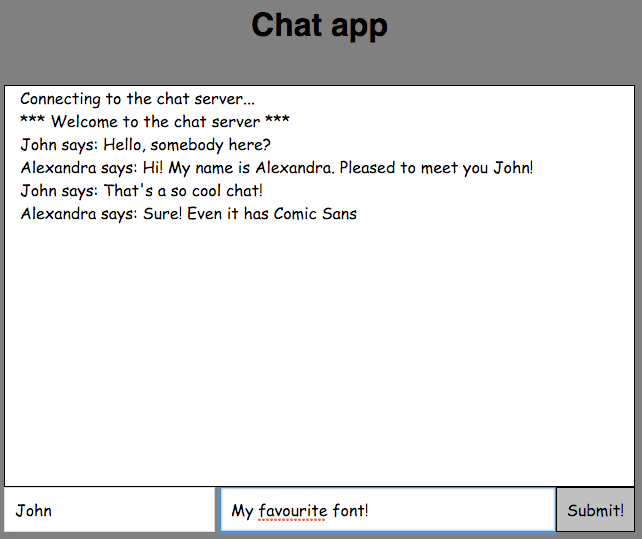

# jEaSSE

Java Easy SSE (Server-Sent Events) implementation (at server side).

Features:

* Minimal footprint, with no 3rd-party dependencies.
* Easily integrable with plain HTTP servlets or Vertx verticles (see below examples)
* Asynchronous operation: don't spend your server threads.
* Broadcasting mode with automatic, thread-safe management of subscribers

## Maven coordinates

### For Servlet >= 3.0 version
    <dependency>
        <groupId>info.macias</groupId>
        <artifactId>jeasse-servlet3</artifactId>
        <version>0.11.1</version>
    </dependency>
    
(You also need to provide the `servlet-api` [3.0.1,) dependencies)

### For Vertx >= 3.1 Version

    <dependency>
        <groupId>info.macias</groupId>
        <artifactId>jeasse-vertx3</artifactId>
        <version>0.11.1</version>
    </dependency>

(You also need to provide `vertx-core` and `vertx-web` [3.1.0,) dependencies.

## Usage examples

### For Servlet >= 3.0
Basic, one-to-one subscription:

	@WebServlet(asyncSupported = true)
	public class ExampleServlet1 extends HttpServlet {
	
		EventTarget target;
		
		@Override
        protected void doGet(HttpServletRequest req, HttpServletResponse resp) throws ServletException, IOException {
           target = new ServletEventTarget(req).ok().open();
        }
	
	    public void onGivenEvent(String info) {
	       target.send("givenEvent",info);
	    }
	}

Subscription to broadcast messages:

	@WebServlet(asyncSupported = true)
	public class ExampleServlet2 extends HttpServlet {
	
		EventBroadcast broadcaster = new EventBroadcast();
		
		// Attaches a subscriber
		@Override
    	protected void doGet(HttpServletRequest req, HttpServletResponse resp) throws ServletException, IOException {
            broadcaster.addSubscriber(new ServletEventTarget(req));
        }
	
	    // Broadcasts a message to all the subscribers
		@Override
		protected void doPost(HttpServletRequest req, HttpServletResponse resp) throws ServletException, IOException {
			broadcaster.broadcast("message","broadcasting that I received a POST message from somebody");
		}	   
	}

Subscription to broadcast messages, with individial welcome message (MessageEvent API used):

	@Override
	protected void doGet(HttpServletRequest req, HttpServletResponse resp) throws ServletException, IOException {
	    MessageEvent welcome = new MessageEvent.Builder().setData("Welcome to the broadcasting service").build();
		broadcaster.addSubscriber(new ServletEventTarget(req),welcome);
	}

### For Vertx >= 3.1

Basic, one-to-one subscription:

    Router router = Router.router(vertx);
    EventTarget target;

    router.get("/subscribe").handler(ctx -> {
        target = new VertxEventTarget(ctx.request());
    });

    router.get("/ongivenevent").handler(ctx -> {
       target.send("givenEvent","I inform you that I received a some event");
    });

Subscription to broadcast messages:

    Router router = Router.router(vertx);
    EventBroadcast broadcaster = new EventBroadcast();

    // Subscription request
    router.get("/subscribe").handler(ctx -> {
        try {
            broadcaster.addSubscriber(new VertxEventTarget(ctx.request());
        } catch (Exception e) {
            e.printStackTrace();
        }
    });

    // Message send request
    router.post("/msg").handler(ctx -> {
        broadcaster.broadcast("message","broadcasting that I have received a POST message");
    });

Subscription to broadcast messages, with individial welcome message (MessageEvent API used):

    router.get("/subscribe").handler(ctx -> {
        try {
            broadcaster.addSubscriber(new VertxEventTarget(ctx.request()),
                    new MessageEvent.Builder().setData("Welcome to the broadcasting service").build()
                    );
        } catch (Exception e) {
            e.printStackTrace();
        }
    });

## Example of usage

To see the easiness of integration of jEaSSe, you can see a simple chat web application in the [examples](examples) folder.

## Client-side libraries

At the moment I do not provide any client-side library. You can use other cool libraries:

* [Jersey's EventInput](https://jersey.java.net/documentation/latest/sse.html#d0e11869)
* [Javascript's EventSource](https://html.spec.whatwg.org/multipage/comms.html#server-sent-events) (Enabled by default in all browsers excepting Internet Explorer/MS Edge)
	- Implementations for Internet Explorer (https://github.com/remy/polyfills/blob/master/EventSource.js) (https://github.com/amvtek/EventSource) (https://github.com/remy/polyfills/blob/master/EventSource.js)
